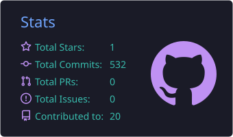
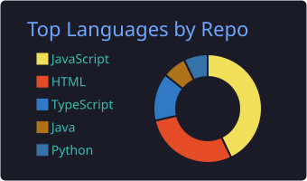
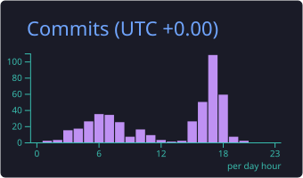

<!-- 

  

---

### 🚀 About Me

I am a passionate and dedicated software developer currently focused on building strong full-stack development skills. My journey is centered around learning modern technologies and creating impactful real-world applications.

I specialize in full-stack development using technologies like JavaScript, TypeScript, React, Node.js, Express, MongoDB, Docker, Kubernetes, Jenkins and SQL/NoSQL databases. I enjoy solving real-world problems by building scalable and efficient web applications.

Alongside development, I actively practice Data Structures and Algorithms to strengthen my problem-solving skills and improve coding efficiency.

I am always eager to learn new technologies, improve my development skills, and work on exciting projects that create real impact.

---

### 🔥 Tech Stack
🚀 **Languages:** Java, Python, JavaScript, TypeScript  
🖥 **Frontend:** HTML5, CSS3, React.js, TailwindCSS  
🛠 **Backend:** Node.js, Express.js, Next.js, MongoDB, MySQL, PostgreSQL, Prisma, Authentication, WebSockets, Redis  
⚡ **DevOps & Cloud:** Docker, Kubernetes, Jenkins, Terraform, Ansible, Prometheus, Grafana, AWS, Nginx, Linux, Bash, CI/CD  
🔁 **Version Control:** Git, GitHub, GitLab  
🛠 **Tools:** Postman, VS Code  
📚 **Currently Learning:** System Design, Serverless Architecture, Monorepos, Scalable Deployments  

  

---

### 🎯 Coding Profiles

  

  

---

### 📊 GitHub Stats

  
  &nbsp;&nbsp;
  

  
  

---

### 📫 Connect with Me

---

⭐ Let's connect and collaborate on exciting projects! 🚀 -->

<!-- STYLE 3: ANIMATED SHOWCASE (banner + typing + snake)
     Needs: the profile-cards workflow AND the snake workflow (snake-workflow.yml).
     Banner comes from capsule-render (hosted on Vercel, so it may occasionally be slow). -->

  

<h3 align="center">🧰 Tech I use</h3>

  

<h3 align="center">📊 My stats</h3>

  
  

  
  

<h3 align="center">🐍 Contribution snake</h3>

  <picture>
    <source media="(prefers-color-scheme: dark)" srcset="https://raw.githubusercontent.com/pranab2108-codes/pranab2108-codes/output/github-snake-dark.svg" />
    
  </picture>

