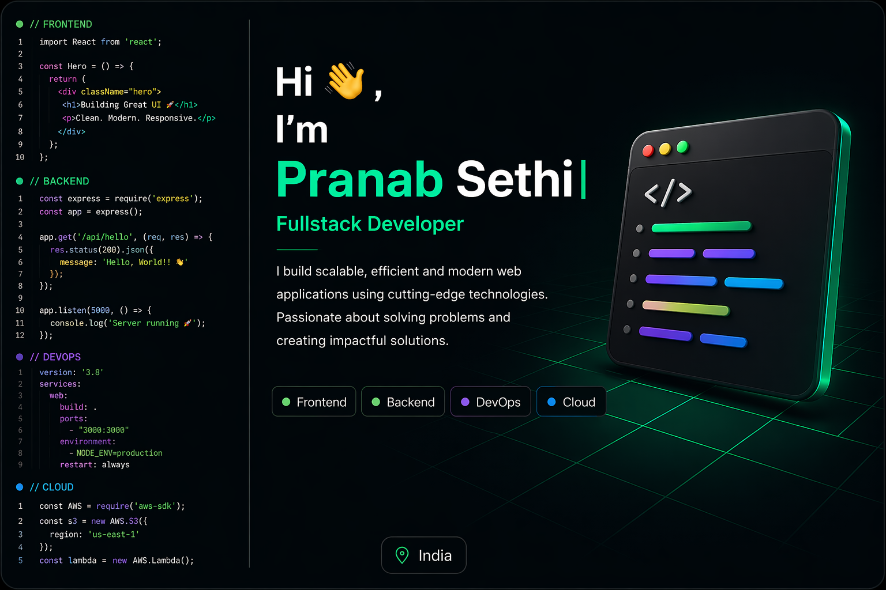
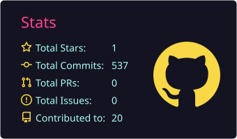
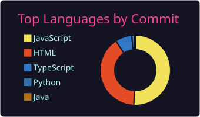
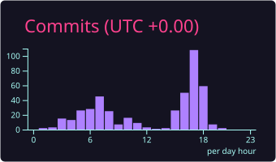

<!-- 

  

---

### 🚀 About Me

I am a passionate and dedicated software developer currently focused on building strong full-stack development skills. My journey is centered around learning modern technologies and creating impactful real-world applications.

I specialize in full-stack development using technologies like JavaScript, TypeScript, React, Node.js, Express, MongoDB, Docker, Kubernetes, Jenkins and SQL/NoSQL databases. I enjoy solving real-world problems by building scalable and efficient web applications.

Alongside development, I actively practice Data Structures and Algorithms to strengthen my problem-solving skills and improve coding efficiency.

I am always eager to learn new technologies, improve my development skills, and work on exciting projects that create real impact.

---

### 🔥 Tech Stack
🚀 **Languages:** Java, Python, JavaScript, TypeScript  
🖥 **Frontend:** HTML5, CSS3, React.js, TailwindCSS  
🛠 **Backend:** Node.js, Express.js, Next.js, MongoDB, MySQL, PostgreSQL, Prisma, Authentication, WebSockets, Redis  
⚡ **DevOps & Cloud:** Docker, Kubernetes, Jenkins, Terraform, Ansible, Prometheus, Grafana, AWS, Nginx, Linux, Bash, CI/CD  
🔁 **Version Control:** Git, GitHub, GitLab  
🛠 **Tools:** Postman, VS Code  
📚 **Currently Learning:** System Design, Serverless Architecture, Monorepos, Scalable Deployments  

  

---

### 🎯 Coding Profiles

  

  

---

### 📊 GitHub Stats

  
  &nbsp;&nbsp;
  

  
  

---

### 📫 Connect with Me

---

⭐ Let's connect and collaborate on exciting projects! 🚀 -->

<!--
  README for pranab2108-codes
  Needs: the profile-cards workflow (generates ./profile-summary-card-output/*).
  Theme used throughout: radical (matches your original stats cards).
  Replace cover.png if you want your own banner image, or drop the capsule-render line instead.
-->

  

  
  

---

### 🚀 About Me

I'm a passionate and dedicated software developer focused on building strong full-stack development skills. My journey centers on learning modern technologies and creating impactful real-world applications.

I specialize in full-stack development with **JavaScript, TypeScript, React, Node.js, Express, MongoDB, Docker, Kubernetes, Jenkins** and SQL/NoSQL databases — solving real-world problems by building scalable, efficient web applications.

Alongside development, I actively practice **Data Structures and Algorithms** to strengthen my problem-solving skills and coding efficiency.

I'm always eager to learn new technologies, improve my craft, and work on projects that create real impact.

---

### 🔥 Tech Stack

| | |
|---|---|
| 🚀 **Languages** | Java, Python, JavaScript, TypeScript |
| 🖥 **Frontend** | HTML5, CSS3, React.js, TailwindCSS |
| 🛠 **Backend** | Node.js, Express.js, Next.js, MongoDB, MySQL, PostgreSQL, Prisma, WebSockets, Redis, Authentication |
| ⚡ **DevOps & Cloud** | Docker, Kubernetes, Jenkins, Terraform, Ansible, Prometheus, Grafana, AWS, Nginx, Linux, Bash, CI/CD |
| 🔁 **Version Control** | Git, GitHub, GitLab |
| 🛠 **Tools** | Postman, VS Code |
| 📚 **Currently Learning** | System Design, Serverless Architecture, Monorepos, Scalable Deployments |

  

---

### 🎯 Coding Profiles

  
  

---

### 📊 GitHub Stats

  
  &nbsp;&nbsp;
  

  
  

### 📈 Contribution Activity

  

---

### 📫 Connect with Me

  
  

⭐ Let's connect and collaborate on exciting projects! 🚀

